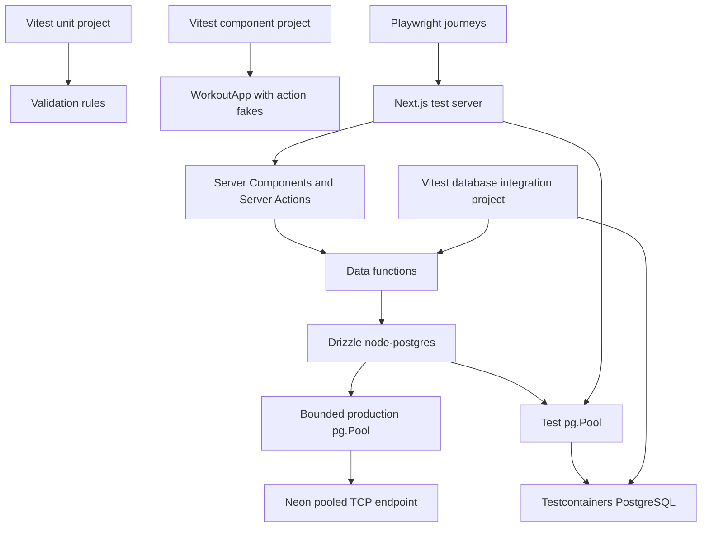

# Testing foundation design

**Spec**: `.specs/features/0001-testing-foundation/spec.md`
**Status**: Approved

---

## Architecture Overview

Drizzle with node-postgres is the only database path. Production uses a bounded,
module-scoped `pg.Pool` connected to Neon's pooled TCP endpoint. Test processes
use the same Drizzle adapter with a pool connected to an ephemeral PostgreSQL
Testcontainer. Data functions therefore exercise the same driver, result shape,
transaction behavior, and PostgreSQL protocol in production and tests.

Vitest owns unit, component integration, and database integration projects.
Playwright owns three browser journeys. A dedicated E2E runner controls the
strict startup order: container, migrations, seed/reset helpers, Next.js
server, Playwright, and teardown.



### Approaches considered

| Approach | Result | Trade-off |
| -------- | ------ | --------- |
| Drizzle with node-postgres everywhere | Selected | Provides full PostgreSQL behavior and maximum production/test parity. |
| Drizzle with Neon HTTP in production and node-postgres in tests | Rejected | Optimizes one-shot serverless queries but creates a driver capability and result-shape gap. |
| Neon HTTP everywhere with a local proxy | Rejected | Adds proxy infrastructure and makes ordinary integration tests more complex. |

The selected approach follows the approved specification and project decision
`AD-003`.

---

## Code Reuse Analysis

### Existing components to leverage

| Component | Location | How to use |
| --------- | -------- | ---------- |
| SQL migrations | `migrations/*.sql` | Apply unchanged in lexical order to every fresh test database. |
| Data functions | `src/data/*.ts` | Preserve exported behavior while moving queries to Drizzle. |
| Domain models | `src/lib/workout.ts`, `src/lib/user.ts` | Keep application-facing types independent from table definitions. |
| Validation parsers | `src/lib/workout-validation.ts` | Test their accepted boundaries and rejection matrix directly. |
| Server Actions | `src/app/actions.ts` | Exercise validation, ownership, persistence, and revalidation together. |
| Client boundary props | `src/components/workout-app.tsx` | Supply action fakes in jsdom component integration tests. |
| Async home page | `src/app/page.tsx` | Cover through Playwright rather than direct Vitest rendering. |

### Integration points

| System | Integration method |
| ------ | ------------------ |
| Neon | Drizzle `node-postgres` adapter using a pooled TCP `DATABASE_URL`. |
| Test PostgreSQL | Drizzle `node-postgres` adapter using a Testcontainers URI. |
| Next.js | Existing Server Component and Server Action boundaries remain intact. |
| Vitest | Named `unit`, `component`, and `database` projects. |
| Playwright | Custom E2E runner supplies the database URI to Next.js and Playwright. |
| Docker-compatible runtime | Testcontainers starts and destroys PostgreSQL. |

---

## Components

### Drizzle schema

- **Purpose**: Describe existing PostgreSQL tables, columns, constraints, and
  relations for typed queries.
- **Location**: `src/db/schema.ts`
- **Interfaces**: Exports table definitions for users, workouts, exercises,
  workout sessions, and completed sets.
- **Dependencies**: `drizzle-orm/pg-core`.
- **Reuses**: The schema already established by `migrations/001_initial.sql`
  and `migrations/002_users.sql`.

The TypeScript schema mirrors the current database. Existing SQL migrations
remain authoritative during this adoption. Drizzle Kit does not generate or
rewrite migrations in scope.

### Production database composition

- **Purpose**: Construct and cache the production pool and Drizzle client.
- **Location**: `src/db/client.ts`
- **Interfaces**: `database(): NodePgDatabase<typeof schema>`.
- **Dependencies**: `drizzle-orm/node-postgres`, `pg`, `DATABASE_URL`, and the
  shared schema.
- **Reuses**: The current missing-`DATABASE_URL` failure behavior from
  `src/lib/db.ts`.

`src/lib/db.ts` is removed after every caller uses the new composition root.
The client validates that production uses Neon's `-pooler` hostname, creates one
module-scoped pool with `max: 5`, and keeps database-dependent code on the
Next.js Node.js runtime. Production never selects a test database from a
general environment flag.

### Test database composition

- **Purpose**: Create and close a Drizzle client connected to the ephemeral
  PostgreSQL database.
- **Location**: `test/database/client.ts`
- **Interfaces**: `createTestDatabase(uri): { database, pool, close }`.
- **Dependencies**: `drizzle-orm/node-postgres`, `pg`, and the shared schema.
- **Reuses**: The production Drizzle schema and node-postgres pattern.

This factory exists only under `test/`. Server code used by Playwright receives
the Testcontainer URI through an explicit test-only composition entry point
chosen by the E2E runner, never through `NODE_ENV` alone.

The PostgreSQL container image is pinned to `postgres:18-alpine`, matching the
deployed Neon PostgreSQL major version.

### Data functions

- **Purpose**: Preserve current user and workout operations while using typed
  Drizzle queries.
- **Location**: `src/data/users.ts` and `src/data/workouts.ts`
- **Interfaces**: Existing exported function signatures remain stable at their
  application call sites.
- **Dependencies**: The production Drizzle client and schema.
- **Reuses**: Current SQL semantics, domain models, ownership checks, ordering,
  and atomic CTE behavior.

Simple reads use Drizzle's query builder. The atomic workout/session writes may
retain explicit Drizzle `sql` CTEs where a query-builder translation would be
less clear. Interactive Drizzle transactions are available when multiple
dependent statements are clearer than one CTE.

### Migration runner

- **Purpose**: Apply the real migration history to a fresh test database.
- **Location**: `test/database/migrate.ts`
- **Interfaces**: `applyMigrations(pool, migrationsDirectory): Promise<void>`.
- **Dependencies**: `pg`, `node:fs/promises`, and `node:path`.
- **Reuses**: Existing SQL migration files.

The runner sorts `*.sql` filenames lexically, executes each file once, and adds
the filename to any thrown setup error. It does not introduce a second test-only
schema path.

### Database reset and fixtures

- **Purpose**: Isolate scenarios and produce minimal valid domain data.
- **Location**: `test/database/reset.ts` and `test/factories/*.ts`
- **Interfaces**: `resetTestDatabase(pool, proof)` plus user and workout fixture
  builders.
- **Dependencies**: `pg`, shared domain types, and a suite-generated proof
  value.
- **Reuses**: Current constraints and the `local-user` ownership convention.

Reset truncates mutable tables with `RESTART IDENTITY CASCADE`. It runs only
when all safety checks pass: a suite-generated proof value is present, the
database name equals the dedicated test database name, and the URI differs from
`DATABASE_URL`. Tests insert their own scenario data after reset.

### Vitest projects

- **Purpose**: Give each test layer the correct runtime and lifecycle.
- **Location**: `vitest.config.ts` and `test/setup/*.ts`
- **Interfaces**: Named `unit`, `component`, and `database` projects.
- **Dependencies**: Vitest, React plugin, jsdom, Testing Library, user-event,
  vite-tsconfig-paths, and Testcontainers.
- **Reuses**: The `*.unit.test.*` and `*.integration.test.*` naming policy in
  `TESTING.md`.

The unit project uses Node and has no Docker dependency. The component project
uses jsdom and action fakes. The database project uses Node, starts one
container in global setup, passes its URI to workers, runs without file-level
parallelism, resets before each test, and stops the container in teardown.

### E2E runner and Playwright configuration

- **Purpose**: Enforce deterministic startup and teardown across PostgreSQL,
  Next.js, and the browser suite.
- **Location**: `test/e2e/run.ts`, `playwright.config.ts`, and
  `test/e2e/workout-journeys.spec.ts`.
- **Interfaces**: `npm run test:e2e` is the public entry point.
- **Dependencies**: Testcontainers, `pg`, Playwright, and Node child processes.
- **Reuses**: Migration, reset, and fixture helpers.

The runner starts PostgreSQL, applies migrations, spawns Next.js with the test
database composition explicitly enabled, waits for readiness, starts Playwright
with the same database URI, and tears down every resource in `finally`. The
Playwright configuration sets one worker and does not start a second web server.
Each scenario resets and seeds its own data through the shared helpers.

### Package scripts and CI gate

- **Purpose**: Expose stable local and automation commands.
- **Location**: `package.json` and a CI workflow if the repository adopts one
  during execution.
- **Interfaces**: `test`, `test:unit`, `test:component`, `test:integration`,
  `test:e2e`, `test:watch`, `typecheck`, and `check`.
- **Dependencies**: The configured runners and existing `lint` and `build`
  scripts.
- **Reuses**: npm and the existing Next.js lifecycle commands.

`test` runs unit, component, database integration, and Playwright suites in
non-watch mode. `test:vitest` runs the three non-browser Vitest projects for a
shorter loop. `check` runs lint, type checking, `test`, and the production
build. A Docker-capable GitHub Actions workflow invokes `check`.

---

## Data Models

### Database context

```typescript
type DatabaseContext = {
  database: NodePgDatabase<typeof schema>;
  pool: Pool;
  close: () => Promise<void>;
};
```

Production and tests return the same Drizzle database type. Production keeps its
pool for the process lifetime. Test lifecycles close their pools explicitly.

### Test database proof

```typescript
type TestDatabaseProof = {
  databaseName: "gym_flow_test";
  suiteId: string;
  connectionUri: string;
};
```

The reset helper requires this value. It validates the database name, non-empty
suite ID, and URI inequality with the configured production URL before issuing
`TRUNCATE`.

### Table relationships

```text
users 1 ── * workouts 1 ── * exercises
users 1 ── * workout_sessions * ── 1 workouts
workout_sessions 1 ── * completed_sets * ── 1 exercises
```

The Drizzle schema mirrors these relationships but does not replace database
foreign keys or checks.

---

## Error Handling Strategy

| Error scenario | Handling | User impact |
| -------------- | -------- | ----------- |
| Missing production `DATABASE_URL` | Throw before constructing the pool. | Application startup or request fails with the existing configuration error. |
| Unpooled Neon production URL | Reject a Neon hostname without `-pooler`. | Deployment fails with a connection-pooling configuration error. |
| Docker unavailable | Preserve the Testcontainers startup error and abort setup. | Integration or E2E command exits non-zero before tests run. |
| Migration failure | Add the migration filename and preserve the original cause. | The suite stops before executing behavior tests. |
| Unsafe reset target | Reject before opening a destructive statement. | The test fails without modifying the database. |
| Next.js E2E server fails | Capture child stderr and abort Playwright. | E2E command exits non-zero with server diagnostics. |
| Playwright fails | Preserve its exit code and trace on first retry in CI. | The quality gate fails and retains browser evidence. |
| Teardown also fails | Report teardown after preserving the primary failure. | The original defect remains visible with cleanup diagnostics. |

---

## Risks & Concerns

| Concern | Location | Impact | Mitigation |
| ------- | -------- | ------ | ---------- |
| Current database factory returns a Neon HTTP-specific tagged template. | `src/lib/db.ts:3` | Production and Testcontainers cannot share the current query boundary. | Replace it with one Drizzle node-postgres composition pattern. |
| Complex writes depend on a single CTE. | `src/data/workouts.ts:82`, `src/data/workouts.ts:129` | A careless ORM translation can lose atomicity. | Preserve atomic SQL where clearer or use a Drizzle transaction, with persistence and failure tests in the same change. |
| Serverless instances can multiply application pools. | `src/db/client.ts` | Unbounded pools can exhaust database connections. | Use Neon's pooled URL and set the module-scoped `pg.Pool` maximum to five connections. |
| node-postgres is unavailable in Edge runtime code. | database import graph | Moving a database caller to Edge would fail at runtime or build time. | Keep database-dependent routes and Server Components on the default Node.js runtime and document the constraint. |
| Owner resolution is fixed to `local-user`. | `src/lib/owner.ts:8` | Server Action tests need deterministic ownership and cross-owner coverage. | Seed `local-user` for action tests and exercise alternate owners at the data layer. Authentication remains out of scope. |
| The home page is an async Server Component. | `src/app/page.tsx:7` | Vitest cannot prove the full render and framework lifecycle. | Cover it through the three Playwright journeys. |
| Component timers make completion flows slow or flaky. | `src/components/workout-app.tsx:67` | Real-time waits would slow component integration tests. | Use fake timers in component tests and user choices that bypass countdowns in E2E. |
| The repository has no CI workflow. | repository root | A documented quality gate may not run remotely. | Add a minimal Docker-capable GitHub Actions workflow that invokes `npm run check`. |
| Future Neon major upgrades can diverge from the pinned test image. | `test/database/container.ts` | Integration behavior may stop matching production. | Document the parity rule and update the pinned `postgres:18-alpine` tag whenever Neon changes major version. |

---

## Tech Decisions

| Decision | Choice | Rationale |
| -------- | ------ | --------- |
| Query layer | Drizzle with `drizzle-orm/node-postgres` everywhere | Shares driver, schema, result shapes, and transaction semantics. |
| Production connection | Module-scoped `pg.Pool` with `max: 5` using Neon's pooled TCP URL | Controls connection growth in the Node.js deployment runtime. |
| Test connection | Lifecycle-scoped `pg.Pool` using the Testcontainer URI | Connects directly to ephemeral PostgreSQL and closes deterministically. |
| PostgreSQL image | `postgres:18-alpine` | Matches the deployed Neon PostgreSQL major version. |
| Migration source | Existing ordered SQL files | Avoids rewriting history and verifies deployable artifacts. |
| Integration lifecycle | One container per suite, reset per test, sequential files | Maximizes determinism before optimizing runtime. |
| Component environment | Vitest with jsdom and Testing Library | Tests interactive behavior without duplicating browser journeys. |
| Browser environment | Playwright with one worker and a custom lifecycle runner | Guarantees the database exists before Next.js starts. |
| Async Server Component coverage | Playwright only | Follows the installed Next.js testing constraint. |
| ORM usage | Typed query builder plus explicit SQL for complex atomic CTEs | Preserves readable PostgreSQL behavior without ORM ceremony. |

Project-level choices are recorded in `.specs/STATE.md` as `AD-002` and
`AD-003`. `AD-003` supersedes the earlier dual-driver decision in `AD-001`.

---

## Research Basis

- The installed Next.js guide states that Vitest does not fully support async
  Server Components and recommends E2E coverage for them.
- Current Vitest documentation supports named projects with distinct
  environments and `--project` filtering.
- Current Drizzle documentation supports node-postgres for Node.js PostgreSQL
  environments, including Neon.
- Current Neon documentation recommends its pooled connection string for
  serverless applications that can create many connections.
- Current Testcontainers documentation provides a PostgreSQL module with a
  generated connection URI and lifecycle control.
- Current Playwright documentation supports controlled web-server startup, but
  the custom runner is selected because PostgreSQL must start before Next.js and
  Playwright must share its generated connection URI.
