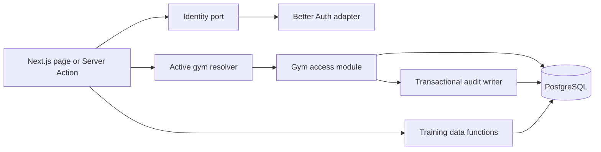

# Gym Workspaces and Memberships Design

**Spec**: `.specs/features/0002-gym-workspaces-memberships/spec.md`  
**Status**: Approved

---

## Architecture Overview

Gym Flow remains one Next.js deployment backed by one PostgreSQL database, but
the server code gains explicit domain boundaries. The gym-access module owns gym
and membership invariants, the identity adapter translates Better Auth sessions
into Gym Flow identities, the active-gym policy resolves tenant context for each
server operation, and the audit writer participates in security-sensitive
transactions.

DDD is applied in proportion to the domain. Gym access is a supporting domain
with real invariants and receives a moderate rich model. Authentication is a
generic capability behind an anti-corruption boundary. Training remains the
product's core domain and is migrated from user ownership to gym ownership
without adding abstractions unrelated to this slice.

### Bounded Contexts

| Context    | Classification | Responsibility                                                                  | Key model                                             |
| ---------- | -------------- | ------------------------------------------------------------------------------- | ----------------------------------------------------- |
| Identity   | Generic        | Authenticate a verified global account and expose a provider-neutral identity   | `AuthenticatedIdentity`, `VerifiedEmail`              |
| Gym Access | Supporting     | Provision gyms, protect owner membership, and resolve active membership context | `Gym`, `Membership`, `GymContext`                     |
| Training   | Core           | Own workout templates and completed sessions within a gym                       | Existing workout/session models, now keyed by `GymId` |
| Audit      | Supporting     | Persist immutable security evidence atomically with protected mutations         | `SecurityAuditEvent`                                  |

Identity supplies a stable user ID to Gym Access through a port. Gym Access
supplies a validated `GymContext` to Training. The contexts share identifiers,
not domain objects. Audit is invoked through a narrow transaction-scoped port;
there is no event bus or outbox because no asynchronous consumer exists in this
slice and GWM-05/GWM-19 require synchronous atomic persistence.

## Code Reuse Analysis

### Existing Components to Leverage

| Component                    | Location                                     | How to Use                                                                                                |
| ---------------------------- | -------------------------------------------- | --------------------------------------------------------------------------------------------------------- |
| PostgreSQL composition root  | `src/db/client.ts`                           | Reuse the existing node-postgres Drizzle connection and transaction support.                              |
| Drizzle schema               | `src/db/schema.ts`                           | Extend the typed schema with identity, gym, membership, selection, audit, and gym-owned training columns. |
| Workout transaction pattern  | `src/data/workouts.ts`                       | Preserve atomic template/session writes while replacing owner filtering with validated gym context.       |
| Current-user boundary        | `src/lib/owner.ts`                           | Replace the temporary local-user lookup with a provider-neutral identity port.                            |
| Database integration harness | `test/database/`                             | Apply the new migration and verify constraints and rollback against PostgreSQL 18.                        |
| Existing behavior boundaries | `src/app/actions.ts`, `src/data/workouts.ts` | Keep Server Actions and data functions as integration-test entry points.                                  |

### Integration Points

| System      | Integration Method                                                                                                               |
| ----------- | -------------------------------------------------------------------------------------------------------------------------------- |
| Better Auth | A server-only adapter maps the provider session to `AuthenticatedIdentity`; provider types do not enter gym or training modules. |
| Next.js     | Server Actions and server-rendered pages resolve identity and active gym before invoking gym-scoped behavior.                    |
| PostgreSQL  | One database and transaction manager; constraints provide concurrency-safe uniqueness and ownership guarantees.                  |

## Domain Model

### Value Objects

- `UserId`, `GymId`, and `MembershipId` are immutable, validated identifiers.
- `VerifiedEmail` trims and lowercases an address for application comparisons;
  PostgreSQL enforces case-insensitive uniqueness on the normalized value.
- `GymContext` contains exactly one `userId`, `gymId`, and active
  `membershipId`. It can only be created by the active-gym resolver.

### Gym Aggregate

`Gym` is an aggregate root with immutable identity and immutable `ownerUserId`.
It exposes provisioning semantics rather than setters. Ownership transfer is
not modeled in this slice.

### Membership Aggregate

`Membership` is a separate aggregate because membership lifecycle grows
independently and a gym may eventually contain an unbounded number of members.
It protects these current invariants:

- one user has at most one membership per gym;
- an owner membership cannot be suspended, removed, or assigned another role;
- inactive memberships cannot produce a `GymContext`.

The database repeats these invariants with unique and check constraints so
concurrent or non-domain writes cannot bypass them.

### Provisioning Transaction

Provisioning creates a `Gym`, its owner `Membership`, and a
`gym.provisioned` audit event in one database transaction. This is a deliberate
cross-aggregate creation transaction required by GWM-04/GWM-05: none of the
three records is valid independently at creation time. Later membership changes
remain scoped to the membership aggregate.

## Components and Interfaces

### Identity Port and Better Auth Adapter

- **Purpose**: Return a stable, verified application identity without leaking
  authentication-provider types.
- **Location**: `src/modules/identity/account/`
- **Interfaces**:
  - `getAuthenticatedIdentity(): Promise<AuthenticatedIdentity>`
  - `requireVerifiedIdentity(): Promise<AuthenticatedIdentity>`
- **Dependencies**: Better Auth's Next.js integration and Drizzle adapter.
- **Reuses**: Replaces the seam currently established by `src/lib/owner.ts`.

Better Auth is selected because its current official integration supports
Next.js, PostgreSQL/Drizzle, verified email, and verified email changes while
preserving the user ID. Authentication UI and production email delivery remain
outside this slice; the adapter and verified-session contract are included.

### Gym Provisioning Application Service

- **Purpose**: Coordinate creation of a gym, immutable owner membership, and
  audit evidence.
- **Location**: `src/modules/gym-access/gym/`
- **Interfaces**:
  - `provisionGym(identity, input): Promise<ProvisionedGym>`
- **Dependencies**: Gym and membership repositories, transaction manager,
  audit writer.
- **Reuses**: Existing Drizzle transaction composition.

### Membership Model and Repository

- **Purpose**: Enforce membership uniqueness, status, and owner immutability.
- **Location**: `src/modules/gym-access/membership/`
- **Interfaces**:
  - `Membership.activate()`
  - `Membership.suspend()`
  - `Membership.changeRole(role)`
  - `findActiveMemberships(userId)`
- **Dependencies**: Drizzle schema and transaction-scoped database handle.
- **Reuses**: Existing server-only data access convention.

Only owner behavior is enabled by this specification. Non-owner role policy and
administration entry points stay deferred to specs 0003 and 0007.

### Active Gym Resolver

- **Purpose**: Produce exactly one validated `GymContext` for gym-scoped work.
- **Location**: `src/modules/gym-access/active-gym/`
- **Interfaces**:
  - `resolveActiveGym(userId): Promise<GymContext>`
  - `selectActiveGym(userId, gymId): Promise<GymContext>`
- **Dependencies**: Membership and active-selection persistence.
- **Reuses**: Server Action boundary for explicit selection.

Selection is persisted in `active_gym_selections`, keyed by user. A single
active membership is auto-selected. Multiple memberships without a valid saved
selection produce a typed `GymSelectionRequiredError`. Invalid, unknown, or
inactive selections produce the same public forbidden result so gym existence
is not disclosed.

### Transactional Audit Writer

- **Purpose**: Append immutable structured security evidence on the caller's
  transaction.
- **Location**: `src/modules/audit/security-event/`
- **Interfaces**:
  - `appendSecurityEvent(tx, event): Promise<void>`
- **Dependencies**: Drizzle transaction handle.
- **Reuses**: Existing PostgreSQL transaction boundary.

There is no update or delete application interface. Event metadata is JSONB;
event type, gym, actor, target, and timestamp remain typed columns for querying.

### Gym-Scoped Training Data

- **Purpose**: Require a validated `GymContext` for workout and session access,
  store gym ownership, and retain creator attribution.
- **Location**: Existing `src/data/workouts.ts` during this slice; migration to
  a dedicated training module can occur when spec 0006 expands the domain.
- **Interfaces**:
  - `listWorkouts(context: GymContext)`
  - `createWorkout(context: GymContext, input)`
  - `saveWorkoutSession(context: GymContext, input)`
- **Dependencies**: Active gym resolver and Drizzle schema.
- **Reuses**: Current mapping, validation, and transactional persistence.

## Data Models

| Table                   | Important fields and constraints                                                                                         |
| ----------------------- | ------------------------------------------------------------------------------------------------------------------------ |
| `users`                 | Better Auth-compatible stable `id`; `email_normalized` unique; `email_verified`; timestamps.                             |
| `gyms`                  | Database-generated UUIDv7 `id`; name; immutable `owner_user_id`; timestamps.                                             |
| `memberships`           | Database-generated UUIDv7 `id`; `gym_id`; `user_id`; `role`; `status`; unique `(gym_id, user_id)`; owner protection.     |
| `active_gym_selections` | `user_id` primary key; `gym_id`; `membership_id`; updated timestamp; membership relationship validated on resolution.    |
| `security_audit_events` | Database-generated UUIDv7 `id`; event type; gym; nullable actor; target type/id; timestamp; JSONB metadata; append-only. |
| `workouts`              | T9 replaces `owner_id` with `gym_id` and `created_by_user_id`; gym-scoped color uniqueness.                              |
| `workout_sessions`      | T9 adds `gym_id`, replaces `owner_id` with `created_by_user_id`, and adds a gym-scoped history index.                    |

The migration may recreate development and test records as confirmed in the
spec. Foreign keys protect referential integrity inside the single deployment;
module code remains the sole writer of its tables.

## Error Handling Strategy

| Error Scenario                                    | Handling                                                                                     | User Impact                          |
| ------------------------------------------------- | -------------------------------------------------------------------------------------------- | ------------------------------------ |
| Missing or unverified session                     | Identity adapter rejects before domain work                                                  | Authentication/verification required |
| Multiple memberships without selection            | Resolver throws `GymSelectionRequiredError`                                                  | User must select a gym               |
| Malformed, unknown, or unauthorized gym           | Resolver returns one public forbidden error and no existence detail                          | Access denied                        |
| Owner mutation attempt                            | Domain guard rejects before persistence; database constraint is the backstop                 | Forbidden                            |
| Concurrent duplicate membership or owner creation | Unique constraint aborts the transaction and maps to a domain conflict                       | Existing membership is retained      |
| Required audit insert failure                     | The enclosing transaction rolls back                                                         | Mutation fails with no partial state |
| Selected membership becomes inactive              | Resolver deletes/clears the stale selection in the same operation and requires a new context | User selects another gym             |

## Testing Strategy

Following `TESTING.md`, PostgreSQL integration tests provide most coverage:

- schema constraints for normalized email, one membership per gym/user, and
  owner protection;
- provisioning success, multiple gyms per account, concurrency, and audit
  rollback;
- active-gym auto-selection, explicit selection, stale selection clearing, and
  non-disclosing denial;
- gym-owned workout/session creation and cross-gym access denial;
- Server Action tests proving identity and context are resolved before writes.

Focused unit tests cover the membership transition matrix and normalized email
value object. Component and browser tests change only where user-visible gym
selection behavior is introduced; the existing three workout journeys remain
the browser-test ceiling unless `TESTING.md` is amended.

## Risks & Concerns

| Concern                                                   | Location                                                  | Impact                                                                       | Mitigation                                                                                                                 |
| --------------------------------------------------------- | --------------------------------------------------------- | ---------------------------------------------------------------------------- | -------------------------------------------------------------------------------------------------------------------------- |
| Hard-coded local identity bypasses authentication         | `src/lib/owner.ts:7`                                      | Every request currently acts as the same account                             | Replace it with the identity port and Better Auth adapter before gym-scoped actions are exposed.                           |
| Training queries authorize by creator rather than tenant  | `src/data/workouts.ts:45`                                 | Creator changes and multi-gym users can cause incorrect ownership or leakage | Require `GymContext` and filter every training query by `gym_id`.                                                          |
| Session writes infer access from workout ownership        | `src/data/workouts.ts:131`                                | The current rule cannot express gym ownership or membership status           | Resolve active membership first and validate workout/exercises against the same `gym_id` transactionally.                  |
| Schema centralizes all contexts                           | `src/db/schema.ts:1`                                      | Growth can blur table ownership                                              | Keep one physical schema for now, group exports by module, and expose writes only through module entry points.             |
| Existing tests and fixtures assume `local-user` ownership | `test/factories/workout.ts:35`                            | Migration will break broad fixture and journey setup                         | Introduce gym/membership factories and update integration fixtures atomically with schema tasks.                           |
| Auth email delivery is outside this feature               | `.specs/features/0002-gym-workspaces-memberships/spec.md` | Production self-service verification cannot be demonstrated in this slice    | Test the verified-session adapter contract; plan delivery/UI as a separate authentication experience before public launch. |

## Tech Decisions

| Decision                        | Choice                                                                           | Rationale                                                                                                                      |
| ------------------------------- | -------------------------------------------------------------------------------- | ------------------------------------------------------------------------------------------------------------------------------ |
| Architectural style             | Evolutionary modular monolith with pragmatic DDD                                 | Strong logical boundaries fit the growing membership roadmap without adding deployment complexity.                             |
| Internal organization           | Flat by aggregate under `src/modules/`                                           | Business concepts remain discoverable while dependencies point inward.                                                         |
| Authentication                  | Better Auth behind an identity port and adapter                                  | It supports current Next.js, Drizzle/PostgreSQL, verified email, and stable IDs without coupling the domain to provider types. |
| Tenant context                  | Persisted database selection resolved on every server operation                  | Server-side validation prevents client-controlled tenant leakage and handles membership invalidation.                          |
| Audit consistency               | Direct transaction-scoped append, no outbox                                      | The current requirement is synchronous atomic evidence; no asynchronous consumer exists.                                       |
| Aggregate transaction exception | Provision gym, owner membership, and audit together                              | GWM-05 explicitly makes the three records one creation invariant.                                                              |
| New entity identifiers          | PostgreSQL 18 `uuidv7()` defaults; Better Auth user IDs remain provider-assigned | UUIDv7 improves index locality, and database defaults avoid application clock and generator concerns.                          |

## Evolution Path

Spec 0002 creates logical boundaries only. Specs 0003-0007 extend the Gym Access
module through its public contracts. A separate deploy, database, message bus,
or outbox is introduced only when an actual independent scaling, failure, or
integration requirement appears.

## Research Basis

- [Better Auth Next.js integration](https://better-auth.com/docs/integrations/next)
- [Better Auth Drizzle adapter](https://better-auth.com/docs/adapters/drizzle)
- [Better Auth verified email changes](https://better-auth.com/docs/concepts/users-accounts)
