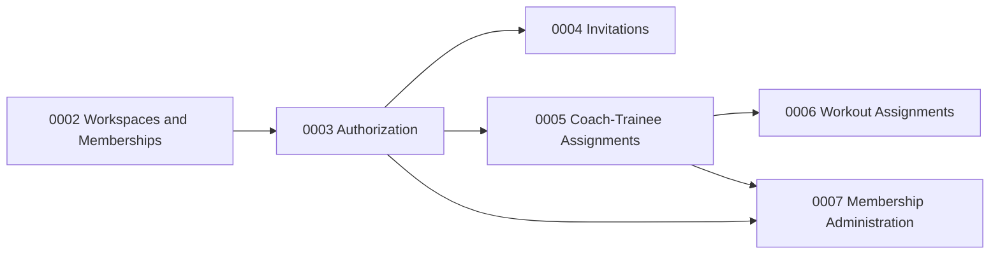

# Gym Membership Access Roadmap

The original gym-membership-access epic is split into independently verifiable slices:

1. `0002-gym-workspaces-memberships`: identity, tenancy, active gym, gym ownership, and audit foundation.
2. `0003-membership-authorization`: role and attribute authorization.
3. `0004-gym-invitations`: invitation delivery, acceptance, concurrency, and rate limits.
4. `0005-coach-trainee-assignments`: many-to-many coaching relationships and visibility.
5. `0006-gym-workout-assignments`: shared templates, trainee assignments, sessions, and history.
6. `0007-membership-administration-audit`: lifecycle, role changes, restoration, assignment cleanup, and feature-specific audits.

Each feature adds its own audit events using the atomic audit contract introduced by 0002.
