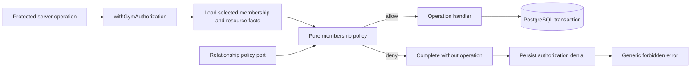
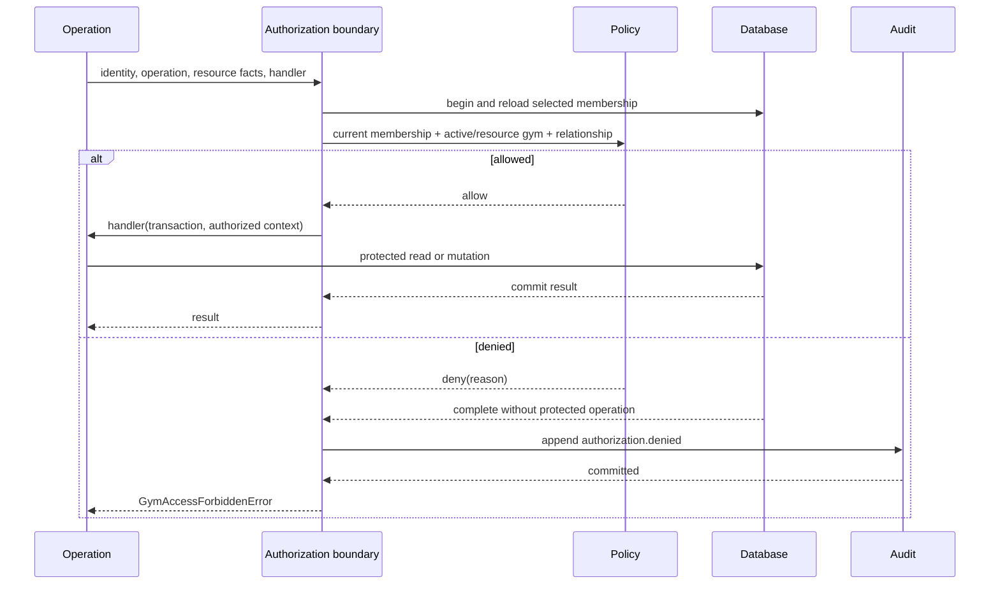

# Membership Authorization Design

**Spec**: `.specs/features/0003-membership-authorization/spec.md`  
**Status**: Approved

---

## Architecture Overview

Gym Access owns one transaction-aware authorization boundary for every
gym-scoped server operation. The boundary reloads the actor's selected
membership from PostgreSQL, validates all required policy facts, evaluates a
pure deny-by-default policy, and invokes the protected data operation only
after an allow decision. UI state and previously resolved context objects are
never authorization evidence.

The public boundary uses an execution wrapper rather than returning a reusable
boolean or capability set. This keeps the locked membership check and an
allowed read or mutation in one database transaction. Required relationship
facts are loaded through the same transaction. A denial completes that
transaction without invoking the operation, persists a security audit event in
a separate write, and then throws one generic forbidden error. If the required
audit write fails, the boundary returns an internal audit failure instead of an
unaudited forbidden response.



### Authorization Sequence



## Policy Model

### Required Facts

Every decision contains these facts:

- actor user ID;
- current membership ID, gym, role, and status loaded from PostgreSQL;
- persisted active-gym selection;
- operation;
- resource type and resource gym;
- relationship facts required by the operation.

Missing resource-gym or required relationship facts deny access. Unknown role,
status, operation, or resource values also deny access. Runtime parsers validate
database strings before constructing policy facts; the implementation must not
cast unknown strings into domain unions.

### Role Capability Matrix

| Operation family                   | Owner            | Admin            | Coach                              | Trainee                   |
| ---------------------------------- | ---------------- | ---------------- | ---------------------------------- | ------------------------- |
| Manage owner membership            | Deny             | Deny             | Deny                               | Deny                      |
| Manage admin membership            | Allow            | Deny             | Deny                               | Deny                      |
| Manage coach membership            | Allow            | Allow            | Deny                               | Deny                      |
| Manage trainee membership          | Allow            | Allow            | Deny                               | Deny                      |
| Manage gym training resources      | Allow            | Allow            | Deny by default                    | Deny by default           |
| Access trainee-specific resources  | Allow within gym | Allow within gym | Require coach-trainee relationship | Require self relationship |
| Access trainee assignments/history | Allow within gym | Allow within gym | Require coach-trainee relationship | Require self relationship |

This slice establishes the matrix and policy hooks. Specs 0005 and 0006 supply
the relationship records and concrete training operations. Until then, coach
and trainee requests requiring those facts are denied.

Owner immutability remains stronger than role capability. An owner can manage
non-owner memberships but cannot change, suspend, remove, or replace an owner
membership. Admins cannot manage owners or other admins.

## Code Reuse Analysis

### Existing Components to Leverage

| Component                    | Location                             | How to use                                                                                                                   |
| ---------------------------- | ------------------------------------ | ---------------------------------------------------------------------------------------------------------------------------- |
| Active-gym resolver          | `src/modules/gym-access/active-gym/` | Reuse selection rules inside the authorization boundary; protected operations stop treating its DTO as sufficient authority. |
| Membership model             | `src/modules/gym-access/membership/` | Extend role vocabulary and preserve owner immutability and status invariants.                                                |
| Gym Access facade            | `src/modules/gym-access/index.ts`    | Export the protected-operation boundary and provider-neutral authorization types.                                            |
| Audit writer                 | `src/modules/audit/security-event/`  | Append structured `authorization.denied` events after a denied decision commits.                                             |
| Drizzle composition root     | `src/db/client.ts`                   | Supply the shared node-postgres transaction used for evaluation and allowed operations.                                      |
| Training data functions      | `src/data/workouts.ts`               | Convert existing functions into handlers invoked through the authorization boundary.                                         |
| Database integration harness | `test/database/`                     | Verify current-state reauthorization, audit persistence, and tenant isolation against PostgreSQL 18.                         |

### Integration Points

| System               | Integration method                                                                                           |
| -------------------- | ------------------------------------------------------------------------------------------------------------ |
| Identity             | Server operations pass the verified provider-neutral user ID into the authorization boundary.                |
| Active gym           | The boundary validates the persisted selection and current membership in the operation transaction.          |
| Protected modules    | Callers supply resource facts and a handler; the handler receives only a transaction and authorized context. |
| Audit                | Denied security decisions append one event before the public forbidden error is returned.                    |
| Future relationships | A narrow policy port supplies relationship facts without coupling Gym Access to assignment storage.          |

## Components and Interfaces

### Membership Policy

- **Purpose**: Evaluate the complete role-and-attribute matrix without database
  or framework dependencies.
- **Location**: `src/modules/gym-access/authorization/membership-policy.ts`
- **Interfaces**:
  - `evaluateMembershipPolicy(facts: AuthorizationFacts): AuthorizationDecision`
  - `AuthorizationDecision = AllowDecision | DenyDecision`
- **Dependencies**: Membership role/status types and the relationship-policy
  result.
- **Reuses**: Existing membership domain vocabulary and owner invariants.

The decision includes an internal reason code for audit metadata. Public errors
never expose that reason.

### Authorized Operation Boundary

- **Purpose**: Load current authorization facts, evaluate policy, coordinate
  the protected transaction, and persist denial evidence.
- **Location**: `src/modules/gym-access/authorization/authorize-gym-operation.ts`
- **Interfaces**:
  - `withGymAuthorization(identity, request, handler): Promise<T>`
  - `request.resolveResourceFacts?(transaction): Promise<AuthorizationResourceFacts>`
  - `handler(transaction, context: AuthorizedGymContext): Promise<T>`
- **Dependencies**: Drizzle transaction manager, active-gym persistence,
  membership policy, relationship policy, and audit writer.
- **Reuses**: Existing `GymAccessForbiddenError` as the only public
  authorization denial.

`AuthorizedGymContext` contains the actor, membership, gym, role, and operation
validated for this invocation. It is scoped to the handler and is not cached or
returned for later operations. The boundary holds a shared lock on the current
membership row until the handler finishes, so membership lifecycle mutations
cannot invalidate an in-flight decision.

Collection and creation operations supply their explicit resource gym in the
request. ID-based operations supply a resource-fact resolver instead. The
boundary invokes that resolver through the same transaction before policy
evaluation. This lets the policy classify a real cross-gym resource for audit
without exposing its existence to the caller. A missing result becomes a
missing-resource-facts denial.

### Relationship Policy Port

- **Purpose**: Supply operation-specific relationship facts without making the
  authorization module own coach-trainee or training-assignment data.
- **Location**: `src/modules/gym-access/authorization/relationship-policy.ts`
- **Interfaces**:
  - `resolveRelationship(transaction, query): Promise<RelationshipResult>`
  - `RelationshipResult = { kind: "satisfied" } | { kind: "absent" }`
- **Dependencies**: A caller-provided adapter when a relationship is required;
  the adapter reads and locks relevant relationship rows through the supplied
  transaction.
- **Reuses**: None; this is the extension point required by AUTHZ-11.

The default implementation returns `absent`. Specs 0005 and 0006 provide
adapters for their own relationship records. The authorization policy never
assumes a relationship from matching gym membership alone.

### Authorization Denial Audit

- **Purpose**: Record cross-gym, role, membership-status, and relationship
  denials before returning the forbidden result.
- **Location**: Extend `src/modules/audit/security-event/` through the existing
  append-only writer.
- **Interfaces**:
  - Existing `appendSecurityEvent(transaction, event): Promise<void>`
- **Dependencies**: A separate short transaction after the denied evaluation
  transaction completes.
- **Reuses**: `security_audit_events` and its append-only database protection.

The event type is `authorization.denied`. Metadata contains a stable reason
code and operation/resource type, but no resource payload or existence detail.
The event uses the actor's selected gym as its audit gym and the requested
resource ID as target when it is a valid UUIDv7; otherwise it targets the
selected gym. Missing or malformed attributes covered only by AUTHZ-12/13 do
not require an audit event unless the denial also has a cross-gym, role,
membership-status, or relationship reason.

### Protected Training Operations

- **Purpose**: Demonstrate that current gym-scoped reads and mutations execute
  only inside the centralized boundary.
- **Location**: `src/data/workouts.ts` and `src/app/actions.ts`
- **Interfaces**:
  - Existing list, create, and session-save behaviors become authorized
    operation handlers.
- **Dependencies**: Authorized operation boundary and its transaction handle.
- **Reuses**: Existing validation, mapping, and persistence logic.

The data functions must use the supplied transaction rather than opening a new
database connection or transaction. Resource lookups include gym predicates,
so a missing and a cross-gym resource produce the same public error.

## Data Models

### Membership Roles

The canonical role set becomes:

```typescript
type MembershipRole = "owner" | "admin" | "coach" | "trainee";
```

A new lexical migration updates existing `member` rows to `trainee`, replaces
the membership role check constraint, and leaves owner constraints unchanged.
The Drizzle schema and domain constants change in the same task. Unknown values
still deny at runtime even though PostgreSQL rejects them on write.

### Authorization Types

```typescript
type AuthorizationRequest = Readonly<{
  operation: GymOperation;
  resource: Readonly<{
    type: GymResourceType;
    id?: string;
    gymId?: string;
  }>;
  resolveResourceFacts?: ResourceFactResolver;
  relationship?: RelationshipQuery;
}>;

type AuthorizedGymContext = Readonly<{
  actorUserId: string;
  membershipId: string;
  gymId: string;
  role: MembershipRole;
  operation: GymOperation;
}>;
```

`GymOperation` and `GymResourceType` are closed runtime-validated vocabularies.
They start with the operation families exercised by this spec. Later specs add
named operations alongside their policy tests instead of passing arbitrary
strings.

No authorization-decision table or capability cache is added. Current
membership and relationship records remain the source of truth.

## Error Handling Strategy

| Error scenario                                          | Handling                                                                                                                            | User impact                                     |
| ------------------------------------------------------- | ----------------------------------------------------------------------------------------------------------------------------------- | ----------------------------------------------- |
| Active gym differs from resource gym                    | Deny, audit `cross_gym`, throw generic `GymAccessForbiddenError`                                                                    | Forbidden without confirming resource existence |
| No current active membership                            | Deny, audit `membership_status` when a selected membership is known, throw generic forbidden                                        | Forbidden                                       |
| Role lacks capability                                   | Deny, audit `role`, throw generic forbidden                                                                                         | Forbidden                                       |
| Required relationship is absent                         | Deny, audit `relationship`, throw generic forbidden                                                                                 | Forbidden                                       |
| Unknown role/status/operation or missing required facts | Deny by default; audit only when an AUTHZ-05 category also applies                                                                  | Forbidden                                       |
| Denial audit cannot be persisted                        | Throw `AuthorizationAuditError`; never return an unaudited policy denial                                                            | Generic server failure                          |
| Protected handler fails                                 | Roll back its transaction and propagate the operation's existing safe error                                                         | No partial mutation                             |
| Membership changes concurrently                         | Membership is read and protected operation executes in one transaction; mutation workflows serialize conflicting membership changes | Decision uses one consistent database state     |

## Testing Strategy

Following AD-002 and `TESTING.md`:

- A table-driven unit suite covers every role, status, gym comparison,
  relationship result, missing fact, and unknown runtime value against the pure
  policy. Assertions derive directly from AUTHZ-01 through AUTHZ-13.
- Database integration tests call the authorized-operation boundary with real
  memberships, active selections, resources, and audit storage. They verify
  allowed execution, handler non-execution on denial, current-state
  reauthorization, generic errors, and one committed audit event per required
  denial.
- Existing workout data integration tests verify that list, creation, and
  session writes use the boundary and cannot be authorized by a forged or stale
  context.
- Server Action integration tests retain the identity-boundary mock but use
  real gym authorization and PostgreSQL behavior.
- No new Playwright journey is added. The existing three journeys exercise the
  protected training wiring without duplicating the authorization matrix.

## Requirement Mapping

| Requirement | Design coverage                                                      |
| ----------- | -------------------------------------------------------------------- |
| AUTHZ-01    | Required facts, membership policy, and authorized operation boundary |
| AUTHZ-02    | Gym equality rule and `cross_gym` denial                             |
| AUTHZ-03    | Current membership reload and active-status rule                     |
| AUTHZ-04    | Resource gym facts plus gym-scoped query predicates                  |
| AUTHZ-05    | Authorization denial audit flow                                      |
| AUTHZ-06    | Owner rows in the role capability matrix plus owner immutability     |
| AUTHZ-07    | Admin rows in the role capability matrix                             |
| AUTHZ-08    | Coach relationship requirement and relationship policy port          |
| AUTHZ-09    | Trainee self-relationship requirement and relationship policy port   |
| AUTHZ-10    | Active-status rule loaded for every invocation                       |
| AUTHZ-11    | Deny-by-default relationship policy port                             |
| AUTHZ-12    | Runtime validation and deny-by-default decision                      |
| AUTHZ-13    | Required fact validation and deny-by-default decision                |

## Risks & Concerns

| Concern                                                                        | Location                                                                                                     | Impact                                                                           | Mitigation                                                                                                           |
| ------------------------------------------------------------------------------ | ------------------------------------------------------------------------------------------------------------ | -------------------------------------------------------------------------------- | -------------------------------------------------------------------------------------------------------------------- |
| Implemented roles differ from the approved vocabulary                          | `src/modules/gym-access/membership/membership.ts:3`, `src/db/schema.ts:198`                                  | `admin` cannot exist and `member` has no specified policy                        | Migrate `member` to `trainee`, add `admin`, and update schema/domain/tests atomically.                               |
| Active gym context omits role and status and can be reused as authority        | `src/modules/gym-access/membership/membership.ts:9`, `src/modules/gym-access/active-gym/active-gym-dto.ts:8` | Membership changes after context resolution can retain access                    | Restrict protected operations to `withGymAuthorization`, which reloads membership inside each operation transaction. |
| Training data functions trust any structurally valid context                   | `src/data/workouts.ts:32`, `src/data/workouts.ts:89`, `src/data/workouts.ts:127`                             | Internal callers can forge gym access or reuse stale membership state            | Accept the boundary's transaction-scoped context and keep gym predicates in every resource query.                    |
| Server Actions currently resolve tenancy but not role capability               | `src/app/actions.ts:10`, `src/app/actions.ts:18`                                                             | Every active member can currently create workouts or sessions                    | Route protected actions through named operations in the centralized boundary.                                        |
| Existing audit helper assumes the caller already owns transaction coordination | `src/modules/audit/security-event/security-event.ts:19`                                                      | Throwing inside the denied operation transaction would roll back its audit event | Complete the denied evaluation transaction, append audit in a separate transaction, then throw forbidden.            |
| Relationship data does not exist in this slice                                 | `.specs/features/0003-membership-authorization/spec.md`                                                      | Coach and trainee access cannot yet be positively authorized                     | Ship the relationship port with a default-deny adapter; specs 0005/0006 supply positive adapters and tests.          |
| Authorization wrapper can become a broad service locator                       | New authorization boundary                                                                                   | Hidden dependencies would make policy hard to test and extend                    | Keep the pure policy independent; inject only database, relationship resolver, audit writer, and operation handler.  |

## Tech Decisions

| Decision                   | Choice                                                                              | Rationale                                                                                                 |
| -------------------------- | ----------------------------------------------------------------------------------- | --------------------------------------------------------------------------------------------------------- |
| Authorization architecture | Central transaction-aware policy boundary in Gym Access                             | One enforceable entry point combines current database state with role and relationship facts.             |
| Caller contract            | Execution wrapper with a transaction-scoped authorized context                      | It prevents reusable capability objects and closes the gap between authorization and protected work.      |
| Policy implementation      | Pure deny-by-default decision function plus database coordinator                    | The full matrix stays fast and exhaustive to unit-test while persistence remains integration-tested.      |
| Role vocabulary            | Replace `member` with `trainee` and add `admin`                                     | It aligns the implemented model with the approved specification before invitation workflows depend on it. |
| Relationship ownership     | Port in Gym Access, adapters owned by relationship-producing features               | Authorization consumes facts without owning coach-trainee or assignment lifecycle.                        |
| Denial auditing            | Commit the decision transaction, persist denial separately, then throw              | A thrown forbidden error must not roll back the required security evidence.                               |
| Database enforcement       | Application authorization with PostgreSQL tenant predicates, not row-level security | It fits the current pooled modular monolith and keeps policy and audit behavior explicit.                 |

## Rejected Alternatives

| Alternative                              | Reason rejected                                                                                                                                                      |
| ---------------------------------------- | -------------------------------------------------------------------------------------------------------------------------------------------------------------------- |
| Precomputed capabilities on `GymContext` | They become stale and cannot prove resource or relationship facts near the data boundary.                                                                            |
| PostgreSQL row-level security            | Session-scoped policy state, pooled connections, and denial auditing add complexity without a current isolation requirement that application predicates cannot meet. |

## Evolution Path

Spec 0004 uses named membership-management operations for invitation
acceptance. Spec 0005 implements the coach-trainee relationship adapter. Spec
0006 adds concrete training-resource and assignment operations. Spec 0007 uses
the same boundary for membership lifecycle changes and keeps those mutations
atomic with their success audit events. Subscription policy can later enter as
another required fact without changing the public execution contract.
